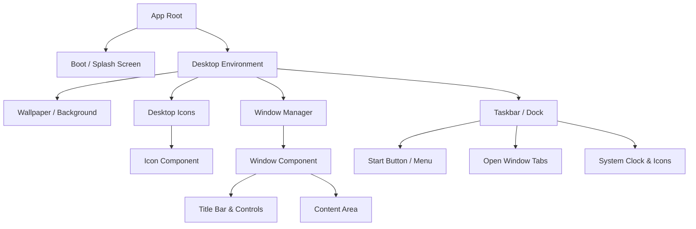

# Cozy Retro OS Portfolio - Design Specification

## 1. Component Hierarchy & Architecture Breakdown

To build a robust, maintainable OS-like interface, we need a clear separation of components and centralized state management for the window system.

### Core State Management (Conceptual)
Whether using Vanilla JS, React, or Vue, the global state must track:
*   `bootState`: Enum (`'waiting'`, `'booting'`, `'desktop'`). Controls the transition from the splash screen to the OS.
*   `openWindows`: Array of objects defining currently open applications.
    *   *Schema*: `{ id, title, type, content, x, y, width, height, zIndex, isMinimized, isMaximized }`
*   `activeWindowId`: Tracks which window currently has focus (for z-index sorting and styling the active state in the taskbar).
*   `theme`: Current color palette (allows for future expansion like light/dark mode or different "OS Themes").

---

## 2. UI/UX & Visual Design Specification

Based on the reference image and the "Cozy Retro" concept, the aesthetic leans heavily into **Neubrutalism meets Pastel Pixel Art**.

### Color Palette
*   **Background (Wallpaper):** Soft Pastel Lavender (`#E6E0F8` or similar) - *Cozy and easy on the eyes.*
*   **Outlines & Shadows:** Soft Black / Deep Charcoal (`#2D2B33`) - *Used for thick borders and hard drop shadows.*
*   **Window Backgrounds:** Off-White or very pale gray (`#FDFDFD`) - *Provides high contrast for content.*
*   **Accents:** Soft Pink (`#FFD1DC`), Mint Green (`#D1FFD7`), or Muted Blue (`#D1E8FF`) for hovered states or active window headers.

### Typography
*   **Primary Font:** A monospaced, retro-terminal font. 
    *   *Suggestions:* `VT323`, `Fira Code`, `Space Mono`, or `JetBrains Mono`.
*   **Styling:** Clean, anti-aliased (or intentionally aliased for a pixel-perfect look), consistently sized.

### Styling & Geometry (The "Cozy Retro" look)
*   **Borders:** Thick, solid borders (e.g., `border: 3px solid #2D2B33;`).
*   **Border Radius:** Soft, rounded corners on windows and buttons (e.g., `border-radius: 12px;`).
*   **Shadows:** Hard, non-blurred drop shadows (e.g., `box-shadow: 6px 6px 0px #2D2B33;`).
*   **Buttons:** Pill-shaped (`border-radius: 9999px;`) for primary actions, as seen in the reference.

### Micro-interactions & Animations
*   **Button Hover/Click:** When hovered, buttons slightly translate up. When clicked, they translate down and right (e.g., `transform: translate(6px, 6px);`), and the hard drop shadow reduces to `0px` to simulate a physical button press.
*   **Window Focus:** Clicking an inactive window brings it to the front (highest `z-index`) and perhaps highlights the title bar slightly.
*   **Boot Sequence (Splash Screen):** 
    1.  Blinking "Press Start" text.
    2.  On click, screen flashes briefly (simulating CRT turn on).
    3.  A quick retro boot log scrolls up, or just a smooth fade-out of the title to reveal the desktop.
    4.  Optional subtle CSS scanlines (`.crt-effect`) overlaid with low opacity.

### Sound Effects (Optional but highly recommended)
*   **Boot:** A synthetic, warm console startup chime.
*   **Hover:** Very quiet, soft static "tick".
*   **Click:** A satisfying, mechanical "clack" or retro UI blip.
*   **Window Open/Close:** A quick "swoosh" or "pop" sound.

---

## 3. Implementation Roadmap

### Phase 1: Foundation & Asset Generation (Static)
*   Set up project structure (HTML, CSS variables for theme colors/shadows, JS).
*   Define the typography and global CSS reset.
*   Build the reusable primitive CSS classes (`.window`, `.btn-retro`, `.hard-shadow`).
*   Gather/create icons (retro pixel icons for folders, text files, executable files).

### Phase 2: The Splash Screen & Boot Sequence
*   Build the full-screen "Title/Splash" landing page.
*   Implement the blinking "Press Start" button.
*   Write the JS logic for the boot transition (hiding the splash screen, showing the desktop, triggering initial animations).

### Phase 3: Desktop Environment & Taskbar Layout
*   Implement the main desktop grid and place desktop icons (`Projects.exe`, `About.txt`).
*   Build the Taskbar pinned to the bottom.
*   Implement the live system clock in the bottom right.

### Phase 4: Window System & State Management (The Core)
*   Create the HTML/CSS structure for a single floating window.
*   Write the Window Manager logic in JavaScript:
    *   **Draggable logic:** Allow grabbing the title bar to move the window.
    *   **Z-Index tracking:** Bring clicked windows to the front.
    *   **Window Controls:** Wire up the Close, Minimize, and Maximize buttons.
*   Link desktop icons to open specific window contents.

### Phase 5: Content Integration (The Portfolio)
*   **AboutMe.txt:** Simple text window with your bio and photo.
*   **Projects.exe:** A more complex window containing a grid or list of your games, GIFs, and links to code/play.
*   **Skills.folder:** Grid of icons representing engines and languages.
*   **Contact.msg:** A form or links to your socials.

### Phase 6: Polish, Polish, Polish
*   Add micro-interactions (button press physics).
*   Implement sound effects (using HTML5 Audio).
*   Add the optional CRT scanline overlay effect.
*   **Mobile Responsiveness:** Crucial step. On mobile screens, abandon the draggable windows and make windows open as full-screen modals to ensure the portfolio is actually usable on phones.
